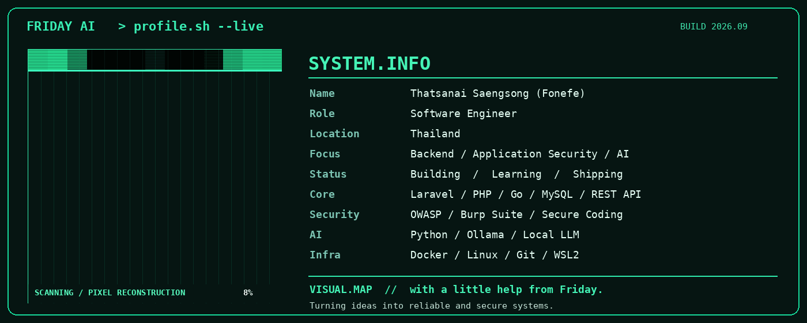

<p align="center">
  
</p>

<h1 align="center">Hi, I'm Fonefe 👋</h1>

<p align="center">
  <strong>Software Engineer · Backend Engineering · Application Security · AI Automation</strong>
</p>

<p align="center">
  🇹🇭 Thailand &nbsp;·&nbsp; 💻 Open to Remote Opportunities
</p>

<p align="center">
  <a href="https://github.com/fonefeforwork">GitHub</a>
  &nbsp;·&nbsp;
  <a href="https://cyber-security-portfolio-v2-web.onrender.com/">Portfolio</a>
</p>

---

## `> whoami`

I'm a Software Engineer with **4 years of software development experience**, building business applications with **PHP, Laravel, and MySQL**.

My work spans understanding business requirements, designing application workflows, implementing backend logic, testing, and supporting deployment.

I'm expanding my work toward **Backend Engineering, Application Security, and local AI Automation**.

```text
NAME       Fonefe
LOCATION   Thailand
CORE       PHP · Laravel · MySQL · REST APIs
WORKFLOW   Requirements → Design → Build → Test → Deploy
FOCUS      Backend · Secure Coding · AI Automation
```

---

## `> engineering_stack`

**Backend**

<p>
  
  
  
  
</p>

**Frontend**

<p>
  
  
  
  
</p>

**Development & Infrastructure**

<p>
  
  
  
  
  
</p>

**Security & Local AI**

<p>
  
  
  
  
  
</p>

---

## `> selected_projects`

### 🍓 Fruit Management System

A business management platform supporting fruit trading operations.

**Features:** Billing, PDF export, Excel export, reporting dashboard, and trading management.

[View repository →](https://github.com/fonefeforwork/billing-system)

### 🌐 Cyber Security Portfolio v2

A portfolio project combining a **Go backend API** with a **Next.js frontend** to present software engineering and security-focused work.

[Live portfolio →](https://cyber-security-portfolio-v2-web.onrender.com/)

### 🔐 Cyber Security Lab

An isolated learning environment for practicing web application security on systems I own or am authorized to test.

**Focus:** OWASP concepts, input validation, authentication, authorization, XSS, CSRF, and secure fixes.

### 🤖 FRIDAY AI

A local AI engineering assistant project built around **Python and Ollama**, with experiments involving development workflows, Git, Docker, logs, and voice capabilities.

**Mission:** Build useful automation while keeping the assistant local.

---

## `> security_focus`

```text
[✓] Authentication & Authorization
[✓] Role-Based Access Control
[✓] Input Validation
[✓] CSRF & XSS Prevention
[✓] Secure File Handling
[✓] Burp Suite Practice
[>] Secure-by-Design Learning
```

I practice security testing in **local labs and authorized environments**.

---

## `> current_mission`

| Working with | Developing further |
|---|---|
| PHP, Laravel, MySQL | Go Backend Engineering |
| Business Applications & REST APIs | Application Security |
| Docker, Git & Linux/WSL2 | AWS Cloud Architecture |
| Python & Ollama Experiments | Local AI Automation |

**Future certification goals:** AWS Solutions Architect – Associate and CompTIA Security+.

---

## `> github_activity`

<p align="center">
  
  
</p>

<p align="center">
  
</p>

<p align="center">
  
</p>

---

## `> connect`

**GitHub:** https://github.com/fonefeforwork

**Portfolio:** https://cyber-security-portfolio-v2-web.onrender.com/

**Location:** Thailand

---

<p align="center">
  <em>Turning ideas into reliable and secure systems.</em><br/>
  <strong>With a little help from FRIDAY.</strong>
</p>